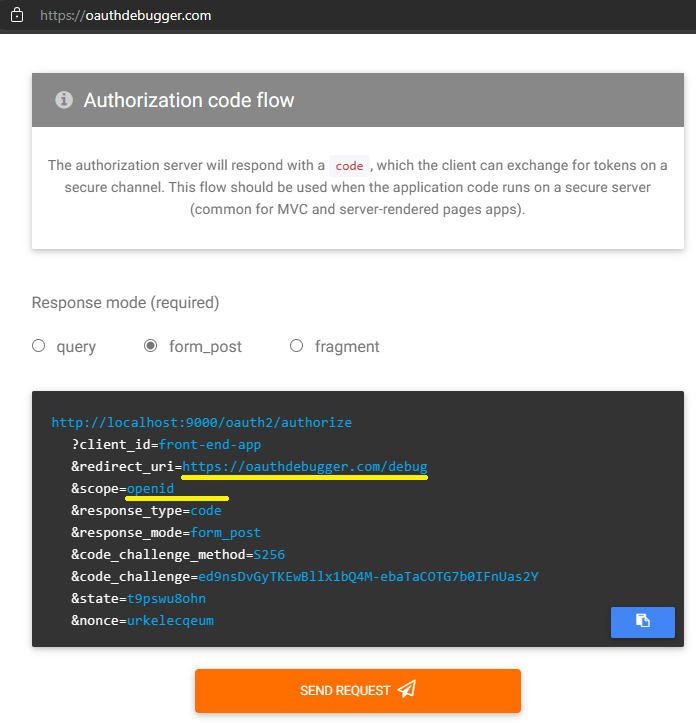

# [Spring Boot 3 - OAuth2.0 Authorization Server y Resource Server - Angular](https://www.youtube.com/playlist?list=PL4bT56Uw3S4zqmhhzJdsA_8aNhttF3mWa)

This project was generated with [Angular CLI](https://github.com/angular/angular-cli) version 16.2.1.

---

# CAPÍTULO 7: Recibiendo Código de Autorización en Cliente Angular

Recordar que el **capítulo 6** y anteriores están en el repositorio del [authorization-server](https://github.com/magadiflo/authorization-server.git).

---

En este capítulo creamos el proyecto de Angular y finalizamos con el `Primer paso` del flujo del tipo de concesión `Authorization Code` de `OAuth 2`.

## Definiendo los environments

Ayudándonos de la `CLI de Angular` crearemos el directorio y archivos donde definiremos las variables de entorno a usar en el proyecto:

````
ng g environments
````
El comando anterior **genera y configura los archivos de entorno para nuestro proyecto**. 

Además de crear los archivos `environment.development.ts` y `environment.ts`, también los configura en el archivo `angular.json`:

```json
"development": {
  ...
  "fileReplacements": [
    {
      "replace": "src/environments/environment.ts",
      "with": "src/environments/environment.development.ts"
    }
  ]
}
```
> **¡IMPORTANTE!**, es necesario bajar y levantar nuevamente el proyecto para que los cambios del `angular.json` hagan efecto.

Procedemos a definir las variables de entorno en el archivo `environment.development.ts` ya que estamos en el entorno de desarrollo:

```typescript
export const environment = {
  AUTHORIZE_URI: 'http://localhost:9000/oauth2/authorize',
  CLIENT_ID: 'front-end-app',
  REDIRECT_URI: 'http://localhost:4200/authorized',
  SCOPE: 'openid profile',
  RESPONSE_TYPE: 'code',
  RESPONSE_MODE: 'form_post',
  CODE_CHALLENGE_METHOD: 'S256',
  CODE_CHALLENGE: 'b2MtJ9pAteYoCGd8aSAolE-CxGbG4MEINELrtkLUQXs',
  CODE_VERIFIER: 'Q1YURYhqGHYUThV7auOYZijKzVhnIvEbTWJmWbeMAkn',
};
```
Ahora, en el archivo de producción `environment.ts` solo definimos las variables, cuando ya se pase a producción estas variables serán definidas:

```typescript
export const environment = {
  AUTHORIZE_URI: '',
  CLIENT_ID: '',
  REDIRECT_URI: '',
  SCOPE: '',
  RESPONSE_TYPE: '',
  RESPONSE_MODE: '',
  CODE_CHALLENGE_METHOD: '',
  CODE_CHALLENGE: '',
  CODE_VERIFIER: '',
};
```
Si observamos la imagen inferior veremos que las variables son las mismas que usamos en la página de [oauthdebugger/debug](https://oauthdebugger.com/debug) con la diferencia del valor del `redirect_uri`, en nuestro caso lo cambiamos para que redireccione a nuestra aplicación cliente de Angular.



En resumen, las variables que estamos definiendo en el `environment` corresponden a las variables que formarán el enlace para poder iniciar el flujo de autenticación con OAuth 2 con el tipo de concesión `Authorization Code`.

## Servicio

Crearemos la clase de servicio donde armaremos el enlace para iniciar el flujo de autenticación en OAuth 2 con el tipo de concesión de `Código de Autorización`. 

Primero crearemos un archivo que contendrá los siguientes detalles que se usarán en la consulta:

````typescript
export const enum AUTHORIZE_REQUEST {
  CLIENT_ID = 'client_id',
  REDIRECT_URI = 'redirect_uri',
  SCOPE = 'scope',
  RESPONSE_TYPE = 'response_type',
  RESPONSE_MODE = 'response_mode',
  CODE_CHALLENGE_METHOD = 'code_challenge_method',
  CODE_CHALLENGE = 'code_challenge',
}
````

Finalmente, creamos nuestra clase de servicio `AuthService` donde crearemos el enlace para iniciar el flujo de autenticacion con nuestro servidor de autorización similar al enlace que nos crea la página `oauthdebugger.com`:

````typescript
@Injectable({
  providedIn: 'root'
})
export class AuthService {

  private get _params(): HttpParams {
    return new HttpParams()
      .set(AUTHORIZE_REQUEST.CLIENT_ID, environment.CLIENT_ID)
      .set(AUTHORIZE_REQUEST.REDIRECT_URI, environment.REDIRECT_URI)
      .set(AUTHORIZE_REQUEST.SCOPE, environment.SCOPE)
      .set(AUTHORIZE_REQUEST.RESPONSE_TYPE, environment.RESPONSE_TYPE)
      .set(AUTHORIZE_REQUEST.RESPONSE_MODE, environment.RESPONSE_MODE)
      .set(AUTHORIZE_REQUEST.CODE_CHALLENGE_METHOD, environment.CODE_CHALLENGE_METHOD)
      .set(AUTHORIZE_REQUEST.CODE_CHALLENGE, environment.CODE_CHALLENGE);
  }

  startFlowOAuth2AuthorizationCode(): void {
    window.location.href = `${environment.AUTHORIZE_URI}?${this._params.toString()}`;
  }

}
````

**NOTA**

> Estamos utilizando la propiedad `href` del objeto `window.location` de javascript para poder cambiar la URL de la página web actual en la que se encuentra el navegador web. En nuestro caso, estaremos cambiando a la dirección del servidor de autorización para iniciar el proceso de autenticación.
>
> No podemos utilizar `HttpClient`, ya que `HttpClient` se utiliza para realizar solicitudes HTTP y obtener datos de una API externa, pero **no puede usarse para redirigir el navegador del usuario a una URL externa.**

## Componentes

Crearemos 3 componentes: **authorized, home y menu**.

El componente `AuthorizedComponent` recibirá el `Authorization Code` devuelto por el servidor de autorización como parte del **primer paso del flujo de autenticación**, así que nos toca recibir dicho código mediante un **query param**:

```typescript
@Component({
  selector: 'app-authorized',
  standalone: true,
  templateUrl: './authorized.component.html',
  styleUrls: ['./authorized.component.scss']
})
export class AuthorizedComponent implements OnInit {

  public code?: string;
  private _activatedRoute = inject(ActivatedRoute);

  ngOnInit(): void {
    this._activatedRoute.queryParams
      .subscribe(({ code }) => this.code = code);
  }

}
```

Para ver el código que nos retorna el servidor imprimimos la variable `code` en la plantilla html:

```html
<h3>Authorization Code</h3>
<pre>
  <code>{{ code }}</code>
</pre>
```

El otro componente importante es el `MenuComponent`, aquí creamos el método `onLogin()` desde donde llamamos al servicio `AuthService` e iniciamos el flujo de autenticación de OAuth 2:

```typescript
@Component({
  selector: 'app-menu',
  standalone: true,
  imports: [RouterLink],
  templateUrl: './menu.component.html',
  styleUrls: ['./menu.component.scss']
})
export class MenuComponent {

  private _authService = inject(AuthService);

  onLogin(): void {
    this._authService.startFlowOAuth2AuthorizationCode();
  }

}
```

A continuación se muestra solo la parte del html donde se inicia el flujo:

```html
<form class="d-flex" role="search">
  <button class="btn btn-outline-success" (click)="onLogin()" type="button">Login</button>
  <button class="btn btn-outline-danger" type="button">Logout</button>
</form>
```

## Routes

Definimos las rutas que usaremos en el proyecto:

```typescript
export const APP_ROUTES: Routes = [
  { path: '', component: HomeComponent, },
  { path: 'authorized', component: AuthorizedComponent, },
  { path: '**', redirectTo: '', pathMatch: 'full', },
];
```


Esta ruta `path: 'authorized'` es muy importante, pues **es la que definimos en los environments** como `redirect_uri`. Es a donde precisamente el servidor de autorización reenviará el `Código de Autorización` como parte de la finalización del **PRIMER PASO** del tipo de concesión de código de autorización.

## AppComponent

En el `AppComponent` importamos los componentes necesarios que usaremos en su html:

```typescript
@Component({
  selector: 'app-root',
  standalone: true,
  imports: [RouterOutlet, MenuComponent],
  templateUrl: './app.component.html',
  styleUrls: ['./app.component.scss']
})
export class AppComponent {
}
```

El html quedaría de esta manera:

```html
<app-menu />
<main class="container">
  <router-outlet />
</main>
```

## Ejecutando aplicación: 1° Paso - Recibir Código de Autorización

Antes de todo, debemos tener levantado el `Autorization Server`, luego proceder a dar el `Login`:


Como mencionamos en un apartado anterior al utilizar el `window.location.href` somos redireccionamos a la página del servidor de autorización. Podemos iniciar sesión con nuestra cuenta de `Google` o con algún usuario que tengamos registrado en el servidor de autorización. Para esta ocasión usaremos el usuario `user` registrado en el servidor de autorización:


Como finalización del **PRIMER PASO** del flujo de tipo de concesión de **Código de Autorización**, luego de iniciar sesión exitosamente en el servidor de autorización, éste nos redirecciona al `redirect_uri` que le definimos en la llamada inicial, en este caso a nuestra aplicación cliente de angular enviándonos el código de autorización que en términos de OAuth 2 este código es la prueba de que el usuario ha interactuado directamente con el `Authorization Server` acreditando su autorización:


---

# CAPÍTULO 8: Obteniendo Access Token en Cliente Angular

---

## EndPoint para obtener Token

Si revisamos las uris que el `servidor de autorización` nos proporciona veremos lo siguiente:

````json
/* http://localhost:9000/.well-known/oauth-authorization-server*/
{
    "issuer": "http://localhost:9000",
    "authorization_endpoint": "http://localhost:9000/oauth2/authorize",
    "device_authorization_endpoint": "http://localhost:9000/oauth2/device_authorization",
    "token_endpoint": "http://localhost:9000/oauth2/token",
    "token_endpoint_auth_methods_supported": [
        "client_secret_basic",
        "client_secret_post",
        "client_secret_jwt",
        "private_key_jwt"
    ],
    "jwks_uri": "http://localhost:9000/oauth2/jwks",
    "response_types_supported": [
        "code"
    ],
    "grant_types_supported": [
        "authorization_code",
        "client_credentials",
        "refresh_token",
        "urn:ietf:params:oauth:grant-type:device_code"
    ],
    "revocation_endpoint": "http://localhost:9000/oauth2/revoke",
    "revocation_endpoint_auth_methods_supported": [
        "client_secret_basic",
        "client_secret_post",
        "client_secret_jwt",
        "private_key_jwt"
    ],
    "introspection_endpoint": "http://localhost:9000/oauth2/introspect",
    "introspection_endpoint_auth_methods_supported": [
        "client_secret_basic",
        "client_secret_post",
        "client_secret_jwt",
        "private_key_jwt"
    ],
    "code_challenge_methods_supported": [
        "S256"
    ]
}
````

De todas estas uris, el que ahora mismo nos interesa es el que nos proporciona el `Access Token`. Este endpoint es el `/oauth2/token` y lo colocaremos en el `environment` de desarrollo, mientras que en el de producción solo definiremos la variable `TOKEN_URL` con una cadena vacía '' como valor. Así mismo,
debemos agregar la variable `GRANT_TYPE` correspondiente al tipo de concesión de código de autorización:

````typescript
export const environment = {
  /* other properties */
  TOKEN_URL: 'http://localhost:9000/oauth2/token',
  GRANT_TYPE: 'authorization_code',
};
````

Ahora, en nuestra clase de servicio `AuthService` necesitamos usar el `HttpClient` para realizar las peticiones a los endpoints del backend. Para que Angular nos permita usar el `HttpClient` necesitamos agregar la función `provideHttpClient()` en el archivo `app.config.ts`:

````typescript
export const appConfig: ApplicationConfig = {
  providers: [
    provideRouter(APP_ROUTES),
    provideHttpClient(), //<--- Nos permitirá trabajar con el HttpClient
  ]
};
````

## Nuevos enum e interfaces

Tenemos que definir nuevas variables de enumeración que serán usadas en la solicitud para la obtención del token:

```typescript
export const enum AUTHORIZE_REQUEST {
  /* other enums */
  GRANT_TYPE = 'grant_type',
  CODE_VERIFIER = 'code_verifier',
  CODE = 'code',
}
```
También definimos la interfaz `Token` que representa el objeto que nos retornará el backend:

````typescript
export interface Token {
  access_token:  string;
  refresh_token: string;
  scope:         string;
  id_token:      string;
  token_type:    string;
  expires_in:    number;
}
````

## Método del servicio para solicitar token

En nuestra clase de servicio creamos el método `getToken(code)` que a partir del código de autorización que le pasemos, deberá realizar una solicitud al backend para traer la información de los tokens:

````typescript
@Injectable({
  providedIn: 'root'
})
export class AuthService {

  private _http = inject(HttpClient);
  private _token_url = environment.TOKEN_URL;

  /* other code */

  public getToken(code: string): Observable<Token> {
    const clientCredentialsBase64 = btoa(`${environment.CLIENT_ID}:secret-key`);
    const headers = this.getHeaders(clientCredentialsBase64);
    const params = this.getParamsToken(code);
    return this._http.post<Token>(this._token_url, params, { headers });
  }

  getParamsToken(code: string): HttpParams {
    return new HttpParams()
      .set(AUTHORIZE_REQUEST.GRANT_TYPE, environment.GRANT_TYPE)
      .set(AUTHORIZE_REQUEST.CLIENT_ID, environment.CLIENT_ID)
      .set(AUTHORIZE_REQUEST.REDIRECT_URI, environment.REDIRECT_URI)
      .set(AUTHORIZE_REQUEST.CODE_VERIFIER, environment.CODE_VERIFIER)
      .set(AUTHORIZE_REQUEST.CODE, code);
  }

  private getHeaders(credentialsEncodedBase64: string): HttpHeaders {
    return new HttpHeaders({
      'Content-Type': 'application/x-www-form-urlencoded',
      'Authorization': `Basic ${credentialsEncodedBase64}`,
    });
  }

}
````
## Inicia solicitud de Token

Luego de obtener el `Authorization Code`, de inmediato solicitamos un `Access Token` con ese código:

````typescript
@Component({
  selector: 'app-authorized',
  standalone: true,
  templateUrl: './authorized.component.html',
  styleUrls: ['./authorized.component.scss']
})
export class AuthorizedComponent implements OnInit {

  public code?: string;
  private _activatedRoute = inject(ActivatedRoute);
  private _authService = inject(AuthService);

  ngOnInit(): void {
    this._activatedRoute.queryParams
      .pipe(
        tap(({ code }) => this.code = code),
        switchMap(({ code }) => this._authService.getToken(code))
      )
      .subscribe(token => console.log(token));
  }
}
````

## Ejecutando: Obteniendo un Access Token al hacer login

Nos vamos a loguear con nuestra cuenta de google para poder obtener un `Access Token` y verificar de esa manera que todo lo realizdo en este capítulo está funcionando. 

¡Ojo!, es necesario que el `Authorization Server` esté levantado:


Listo, como observamos, estamos obteniendo un `access token` o para ser precisos varios tokens como prueba de que el flujo del tipo de concesión de código de autorización se efectuó correctamente.

---
# CAPÍTULO 9: Almacenando tokens en localStorage

---

Definimos las constantes a usar para poder almacenar los tokens:

````typescript
/* interfaces.ts */
export const ACCESS_TOKEN: string = 'access_token';
export const REFRESH_TOKEN: string = 'refresh_token';
````

Creamos la clase de servicio `TokenService` done definiremos la lógica para almacenar los tokens:

````typescript
@Injectable({
  providedIn: 'root'
})
export class TokenService {

  setTokens(accessToken: string, refreshToken: string): void {
    localStorage.setItem(ACCESS_TOKEN, accessToken);
    localStorage.setItem(REFRESH_TOKEN, refreshToken);
  }

}
````

Finalmente, desde el componente `AuthorizedComponent` llamamos a nuestro servicio anterior para almacenar el token:

````typescript
@Component({
  selector: 'app-authorized',
  standalone: true,
  templateUrl: './authorized.component.html',
  styleUrls: ['./authorized.component.scss']
})
export class AuthorizedComponent implements OnInit {

  public code?: string;
  private _activatedRoute = inject(ActivatedRoute);
  private _authService = inject(AuthService);
  private _tokenService = inject(TokenService);

  ngOnInit(): void {
    this._activatedRoute.queryParams
      .pipe(
        tap(({ code }) => this.code = code),
        switchMap(({ code }) => this._authService.getToken(code))
      )
      .subscribe(token => {
        console.log(token);
        this._tokenService.setTokens(token.access_token, token.refresh_token);
      });
  }

}
````
---
# CAPÍTULO 10: Accediendo al Resource Server desde cliente Angular

---

En este capítulo consumiremos los recursos expuestos por el `Resource Server`, ya que hasta este punto disponemos del `Access Token` para realizar ese consumo. Primero debemos agregar la url del Servidor de Recurso en los environments:

````typescript
export const environment = {
  /* other variables */
  RESOURCE_URL: 'http://localhost:8080/api/v1/resources',
};
````

En la clase de servicio `TokenService` agregamos métodos para recuperar el `access_token` y el `refresh_token`:

````typescript
@Injectable({
  providedIn: 'root'
})
export class TokenService {

  /* other method */

  getAccessToken(): string | null {
    return localStorage.getItem(ACCESS_TOKEN);
  }

  getRefreshToken(): string | null {
    return localStorage.getItem(REFRESH_TOKEN);
  }

}
````

## Interceptor - Agregando JWT a los request

Crearemos un interceptor funcional que nos permitirá agregar el `access_token` a todas las peticiones que se dirigan al endpoint del resource server. Para eso necesitamos clonar la request:

````typescript
export const resourceInterceptor: HttpInterceptorFn = (req, next) => {
  const tokenService = inject(TokenService);
  const token = tokenService.getAccessToken();
  let modifiedReq = req;

  if (token !== null && req.url.includes('resources')) {
    modifiedReq = req.clone({
      headers: req.headers.set(`Authorization`, `Bearer ${token}`),
    });
  }
  return next(modifiedReq);
};
````
Para que nuestro interceptor entre en funcionamiento es necesario configurarlo en el archivo `app.config.ts` agregándolo dentro de la función `withInterceptors([...])` y este a su vez dentro del `provideHttpClient(...)`:

````typescript
export const appConfig: ApplicationConfig = {
  providers: [
    provideRouter(APP_ROUTES),
    provideHttpClient(withInterceptors([resourceInterceptor])),
  ]
};
````

## ResourceService para consumir endpoint del Servidor de Recurso

Creamos nuestro servicio que apuntará al los endpoints del servidor de recursos:

````typescript
interface ResponseResourceServer {
  message: string;
}

@Injectable({
  providedIn: 'root'
})
export class ResourceService {

  private _http = inject(HttpClient);
  private _resourceUrl = environment.RESOURCE_URL;

  user(): Observable<ResponseResourceServer> {
    return this._http.get<ResponseResourceServer>(`${this._resourceUrl}/user`)
  }

  admin(): Observable<ResponseResourceServer> {
    return this._http.get<ResponseResourceServer>(`${this._resourceUrl}/admin`)
  }
}
````
## Componentes Visuales: Admin y User

Creamos el componente user y de inmediato llamamos al resource server:

````typescript
@Component({
  selector: 'app-user',
  standalone: true,
  imports: [CommonModule],
  templateUrl: './user.component.html',
  styleUrls: ['./user.component.scss']
})
export class UserComponent implements OnInit {

  public message: string = '';
  private _resourceService = inject(ResourceService);

  ngOnInit(): void {
    this._resourceService.user()
      .subscribe({
        next: response => this.message = response.message,
        error: err => {
          this.message = `status[${err.status}], message: ${err.message}`;
          console.log(err);
        }
      });
  }

}
````

El html del componente UserComponent:

````html
<div class="alert alert-success mt-3">{{ message }}</div>
````

Al igual que el componente User, toca ahora crear el componente Admin:

````typescript
@Component({
  selector: 'app-admin',
  standalone: true,
  imports: [CommonModule],
  templateUrl: './admin.component.html',
  styleUrls: ['./admin.component.scss']
})
export class AdminComponent {

  public message: string = '';
  private _resourceService = inject(ResourceService);

  ngOnInit(): void {
    this._resourceService.admin()
      .subscribe({
        next: response => this.message = response.message,
        error: err => {
          this.message = `status[${err.status}], message: ${err.message}`;
          console.log(err);
        }
      });
  }

}
````

## Definiendo rutas para admin y user

En el `app.routes.ts` definimos las rutas para nuestros nuevos componentes:

````typescript
export const APP_ROUTES: Routes = [
  { path: '', component: HomeComponent, },
  { path: 'authorized', component: AuthorizedComponent, }, 
  { path: 'user', component: UserComponent, },
  { path: 'admin', component: AdminComponent, },
  { path: '**', redirectTo: '', pathMatch: 'full', },
];
````

Finalmente, las definimos en el html: 

````html
<li class="nav-item">
  <a class="nav-link" [routerLink]="['/user']">User</a>
</li>
<li class="nav-item">
  <a class="nav-link" [routerLink]="['/admin']">Admin</a>
</li>
````

## Probando acceso al Resource Server desde Cliente Angular

Primero debemos dar clic en el botón de `Login` para que podamos registrar el `access_token` en el localStorage. Solo habiendo realizado lo anterior, procedemos a ingresar al menú `user` que está apuntando al endpoint `/user` en el servidor de recuros y además ese endpoint está segurizado para los usuarios con rol `OIDC_USER`, correspondiente a los usuarios que se loguean con su cuenta de google y es precisamente con nuestra cuenta de google que nos logueamos (también puede ser con la cuenta propia registrada en el Authorization Server. Actualmente en la BD tenemos registrado a `admin` y `user`):


---
# CAPÍTULO 11: Implementación del Logout

---

## Definiendo endpoint del logout

Definimos la variable que contendrá el endpoint en el servidor de autorización correspondiente al logout:

````typescript
export const environment = {
  /* other variables */
  LOGOUT_URL: 'http://localhost:9000/logout',
};
````

Método en el `token.service.ts` para limpiar los tokens del localStorage:

````typescript
@Injectable({
  providedIn: 'root'
})
export class TokenService {
  /* other methods */
  clear(): void {
    localStorage.removeItem(ACCESS_TOKEN);
    localStorage.removeItem(REFRESH_TOKEN);
  }
}
````
Método en el `auth.service.ts` para redireccionar al usuario al formulario de logout:

````typescript

@Injectable({
  providedIn: 'root'
})
export class AuthService {
  /* other code */
  logout(): void {
    window.location.href = environment.LOGOUT_URL;
  }
}
````

## Componente Logout

El servidor de autorización redireccionará a una ruta en nuestra aplicación cliente luego de que ocurra un logout exitoso. Para eso necesitamos crear un componente logout que apuntará a dicha ruta.

Como se obseva en el `ngOnInit()` una vez que se redireccione a este componente, de inmediato nuestro componente lo redireccionará a la raíz del proyecto cliente:

````typescript
@Component({
  selector: 'app-logout',
  standalone: true,
  imports: [CommonModule],
  templateUrl: './logout.component.html',
  styleUrls: ['./logout.component.scss']
})
export class LogoutComponent implements OnInit {

  private _tokenService = inject(TokenService);
  private _router = inject(Router);

  ngOnInit(): void {
    this._tokenService.clear();
    this._router.navigate(['/']);
  }

}
````

Ahora, en el archivo `app.routes.ts` definimos la ruta `/logout` para nuestro nuevo componente:

````typescript

export const APP_ROUTES: Routes = [
  /* other routes */
  { path: 'logout', component: LogoutComponent, },
  /* other routes */
];
````

## Menú Logout

Agregamos el método `onLogout()` en el componente MenuComponent para iniciar el proceso de deslogueo:

````typescript
@Component({
  selector: 'app-menu',
  standalone: true,
  imports: [RouterLink],
  templateUrl: './menu.component.html',
  styleUrls: ['./menu.component.scss']
})
export class MenuComponent {

  /* other code */

  onLogout(): void {
    this._authService.logout();
  }

}
````

Finalmente, en su componente html lo llamamos:

````html
<button class="btn btn-outline-danger" (click)="onLogout()" type="button">Logout</button>
````

## Redireccionando a la raíz del proyecto cuando se hace login

Anteriormente, cada vez que iniciábamos sesión el authorization server nos redirigía a la ruta `/authorized`. Eso está bien, pero lo que haremos ahora será que en vez de que se quede en dicha página, lo redireccionaremos de inmediato a la raíz del proyecto cliente:

````typescript
@Component({
  selector: 'app-authorized',
  standalone: true,
  templateUrl: './authorized.component.html',
  styleUrls: ['./authorized.component.scss']
})
export class AuthorizedComponent implements OnInit {

  /* properties */

  ngOnInit(): void {
    this._activatedRoute.queryParams
      .pipe(
        tap(({ code }) => this.code = code),
        switchMap(({ code }) => this._authService.getToken(code))
      )
      .subscribe(token => {
        console.log(token);
        this._tokenService.setTokens(token.access_token, token.refresh_token);
        this._router.navigate(['/']);
      });
  }

}
````
---

# CAPÍTULO 12: Definiendo menú según rol del usuario

---

## Métodos isLogged() e isAdmin()

En nuestro servicio `TokenService` agregamos los dos métodos siguientes:

````typescript

@Injectable({
  providedIn: 'root'
})
export class TokenService {

  /* other code */

  isLogged(): boolean {
    return localStorage.getItem(ACCESS_TOKEN) !== null;
  }

  isAdmin(): boolean {
    if (!this.isLogged()) return false;
    const token = this.getAccessToken();
    const payload = token!.split(".")[1];
    const payloadDecoded = atob(payload);
    const values = JSON.parse(payloadDecoded);
    const roles = values.roles;
    return !(roles.indexOf('ROLE_ADMIN') < 0);
  }

}
````

Nótese que a partir del jwt almacenado en el localStorage estamos obteniendo el rol del usuario actual.

## Modificando Menú

En función del rol del usuario actual o si está logueado es que mostraremos el menú de la aplicación:

````typescript
@Component({
  selector: 'app-menu',
  standalone: true,
  imports: [RouterLink, NgIf],
  templateUrl: './menu.component.html',
  styleUrls: ['./menu.component.scss']
})
export class MenuComponent implements OnInit {

  public isLogged: boolean = false;
  public isAdmin: boolean = false;
  private _authService = inject(AuthService);
  private _tokenService = inject(TokenService);

  /* other methods */

  getLogged(): void {
    this.isLogged = this._tokenService.isLogged();
    this.isAdmin = this._tokenService.isAdmin();
  }

}
````

Su respectivo html quedaría así: 

````html
<ul class="navbar-nav me-auto mb-2 mb-lg-0">
  <li class="nav-item">
    <a class="nav-link active" aria-current="page" [routerLink]="['/']">Home</a>
  </li>
  <li class="nav-item">
    <a class="nav-link" [routerLink]="['/user']" *ngIf="isLogged">User</a>
  </li>
  <li class="nav-item">
    <a class="nav-link" [routerLink]="['/admin']" *ngIf="isAdmin">Admin</a>
  </li>
</ul>
<form class="d-flex" role="search">
  <button class="btn btn-outline-success" *ngIf="!isLogged" (click)="onLogin()" type="button">Login</button>
  <button class="btn btn-outline-danger" *ngIf="isLogged" (click)="onLogout()" type="button">Logout</button>
</form>
````

## Modificando el AppComponent

Agregamos la referencia `#menu` a la directiva `<app-menu />`: 

````html
<app-menu #menu/>
<main class="container">
  <router-outlet />
</main>
````

Finalmente, en su componente de typescript usamos la referencia para llamar a su método `getLogged()`:

````typescript
@Component({
  selector: 'app-root',
  standalone: true,
  imports: [RouterOutlet, MenuComponent],
  templateUrl: './app.component.html',
  styleUrls: ['./app.component.scss']
})
export class AppComponent implements OnInit {

  @ViewChild('menu') menu!: MenuComponent;
  private _router = inject(Router);

  ngOnInit(): void {
    this._router.events
      .pipe(
        // NavigationEnd, un evento que se desencadena cuando una navegación finaliza correctamente.
        filter((e): e is NavigationEnd => e instanceof NavigationEnd) 
      )
      .subscribe(resp => {
        console.log('Filtró NavigationEnd', resp);
        this.menu!.getLogged();
      });
  }
}
````

---
# CAPÍTULO 13: Generando Code Verifier y Code Challenge - PKCE

---

## Istalando dependencias

Necesitamos intalar la dependencia de `crypto-js` para poder encriptar en `Code Verifier`:

````
npm install crypto-js @types/crypto-js
````

**NOTA**
> Recordar que desde un inicio hemos estado usando el `code_verifier` y `code_challenge` hardcodeado, pero en este capítulo generaremos ambos códigos.
>
> La lógica con estos dos códigos es: "A partir del `Code Verifier` obtenemos el `Code Challenge` pero no al revés"


## Definiendo variables

Modificamos los archivos `environment` quitándo las dos propiedades hardcodeadas: `CODE_VERIFIER` y `CODE_CHALLENGE` ya que estos códigos los crearemos manualmente. Lo que sí agregaremos será la propiedad `SECRET_PKCE`. 

A continuación se muestran todas las propiedades definidas en los archivos `environment`: 

````typescript
export const environment = {
  AUTHORIZE_URI: 'http://localhost:9000/oauth2/authorize',
  CLIENT_ID: 'front-end-app',
  REDIRECT_URI: 'http://localhost:4200/authorized',
  SCOPE: 'openid profile',
  RESPONSE_TYPE: 'code',
  RESPONSE_MODE: 'form_post',
  CODE_CHALLENGE_METHOD: 'S256',
  TOKEN_URL: 'http://localhost:9000/oauth2/token',
  GRANT_TYPE: 'authorization_code',
  RESOURCE_URL: 'http://localhost:8080/api/v1/resources',
  LOGOUT_URL: 'http://localhost:9000/logout',
  SECRET_PKCE: 'mi-clave-secreta',
};
````
Creamos una nueva constante en el archivo de `interfaces.ts`: 

````typescript
/* other properties */
export const CODE_VERIFIER: string = 'code_verifier';
````

## Generando códigos

En el servicio `auth.service.ts` definimos los métodos para crear los códigos: Code Verifier y Code Challenge. Además se realizan otras modificaciones, por lo que a continuación se muestra la clase completa del servicio:

````typescript
/* other imports */
import * as CryptoJS from 'crypto-js';

@Injectable({
  providedIn: 'root'
})
export class AuthService {

  private _http = inject(HttpClient);
  private _tokenService = inject(TokenService);
  private _token_url = environment.TOKEN_URL;
  private static readonly CHARACTERS: string = 'ABCDEFGHIJKLMNOPQRSTUVWXYZabcdefghijklmnopqrstuvwxyz0123456789';

  startFlowOAuth2AuthorizationCode(): void {
    const codeVerifier = this.generateCodeVerifier();
    this._tokenService.setVerifier(codeVerifier);
    const codeChallenge = this.generateCodeChallenge(codeVerifier);
    window.location.href = `${environment.AUTHORIZE_URI}?${this.getParamsCode(codeChallenge).toString()}`;
  }

  logout(): void {
    window.location.href = environment.LOGOUT_URL;
  }

  getToken(code: string, codeVerifier: string): Observable<Token> {
    const clientCredentialsBase64 = btoa(`${environment.CLIENT_ID}:secret-key`);
    const headers = this.getHeaders(clientCredentialsBase64);
    const params = this.getParamsToken(code, codeVerifier);
    return this._http.post<Token>(this._token_url, params, { headers });
  }

  getParamsCode(codeChallenge: string): HttpParams {
    return new HttpParams()
      .set(AUTHORIZE_REQUEST.CLIENT_ID, environment.CLIENT_ID)
      .set(AUTHORIZE_REQUEST.REDIRECT_URI, environment.REDIRECT_URI)
      .set(AUTHORIZE_REQUEST.SCOPE, environment.SCOPE)
      .set(AUTHORIZE_REQUEST.RESPONSE_TYPE, environment.RESPONSE_TYPE)
      .set(AUTHORIZE_REQUEST.RESPONSE_MODE, environment.RESPONSE_MODE)
      .set(AUTHORIZE_REQUEST.CODE_CHALLENGE_METHOD, environment.CODE_CHALLENGE_METHOD)
      .set(AUTHORIZE_REQUEST.CODE_CHALLENGE, codeChallenge);
  }

  getParamsToken(code: string, codeVerifier: string): HttpParams {
    return new HttpParams()
      .set(AUTHORIZE_REQUEST.GRANT_TYPE, environment.GRANT_TYPE)
      .set(AUTHORIZE_REQUEST.CLIENT_ID, environment.CLIENT_ID)
      .set(AUTHORIZE_REQUEST.REDIRECT_URI, environment.REDIRECT_URI)
      .set(AUTHORIZE_REQUEST.CODE_VERIFIER, codeVerifier)
      .set(AUTHORIZE_REQUEST.CODE, code);
  }

  private getHeaders(credentialsEncodedBase64: string): HttpHeaders {
    return new HttpHeaders({
      'Content-Type': 'application/x-www-form-urlencoded',
      'Authorization': `Basic ${credentialsEncodedBase64}`,
    });
  }

  generateCodeVerifier(): string {
    let result = '';
    const charLength = AuthService.CHARACTERS.length;
    for (let i = 0; i < 44; i++) {
      result += AuthService.CHARACTERS.charAt(Math.floor(Math.random() * charLength));
    }
    return result;
  }

  generateCodeChallenge(codeVerifier: string): string {
    const codeVerifierHash = CryptoJS.SHA256(codeVerifier).toString(CryptoJS.enc.Base64);
    const codeChallenge = codeVerifierHash
      .replace(/=/g, '')
      .replace(/\+/g, '-')
      .replace(/\//g, '_');
    return codeChallenge;
  }

}
````

En el servicio `token.service.ts` creamos los métodos que nos permitirá almacenar el código en el localStorate temporalmente:

````typescript
/* other imports */
import * as CryptoJS from 'crypto-js';

@Injectable({
  providedIn: 'root'
})
export class TokenService {

  /* other code */
  
  setVerifier(codeVerifier: string): void {
    if (localStorage.getItem(CODE_VERIFIER)) {
      this.deleteVerifier();
    }
    const encrypted = CryptoJS.AES.encrypt(codeVerifier, environment.SECRET_PKCE);
    localStorage.setItem(CODE_VERIFIER, encrypted.toString());
  }

  getVerfier(): string {
    const encrypted = localStorage.getItem(CODE_VERIFIER)!;
    const decrypted = CryptoJS.AES.decrypt(encrypted, environment.SECRET_PKCE).toString(CryptoJS.enc.Utf8);
    return decrypted;
  }

  deleteVerifier(): void {
    localStorage.removeItem(CODE_VERIFIER);
  }
}
````
